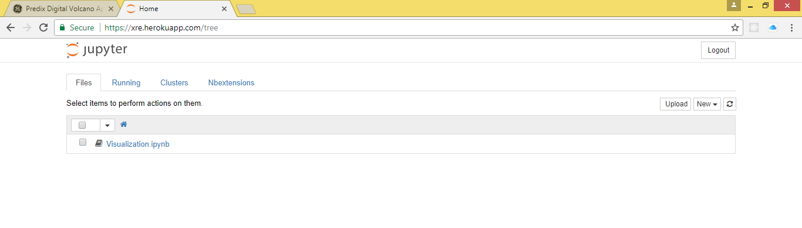
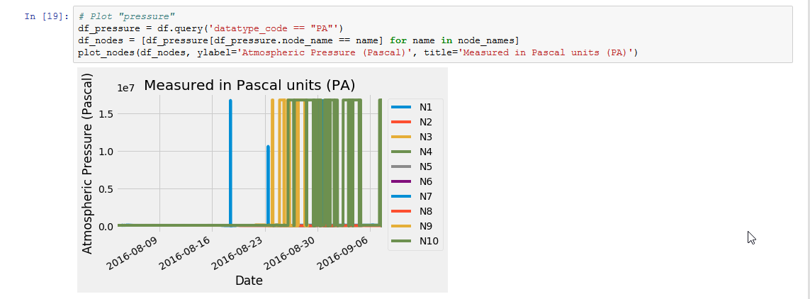
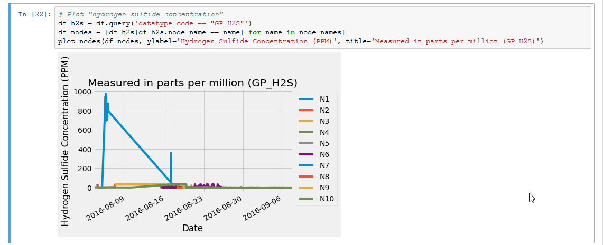

# Digital Volcano Visualization
## 1.0. Overview
This submission uses a Jupyter Notebook to explore the data in `csv` files included with the repo.
All the `csv` files at `setup/data/*.csv` are imported into a notebook named `Visualization` under the `notebooks` folder.

Due to the large file size of the slug generated for the Jupyter Notebook, deployment to Predix's free plan fails but it works on Heroku.

This document will describe how to run the Jupyter Notebook locally as well as on Heroku.


## 2.0. Visualization
Exploration of the `csv` data revealed that there are 176,534 datapoints in the timeseries data and only 63,456 datapoints have non-null values but there are only 36,278 unique timestamps. 

To summarize, there are:

- 11 unique nodes (nodes 'N1'-'N10' and a 'Real-time Seismic Amplitude Measurement' or 'RSAM' node);
- 61 unique sensors (each of node 'N1'-'N10' had 6 sensors plus the 'RSAM' node sensor i.e. 6 * 10 + 1)
- 7 unique data types


## 3.0. Local Deployment
### Prerequisites
You must clone the [repo](https://github.com/PredixDev/predix-volcano-app) and follow the steps below to be able to successfully run the app under your Predix account.

This is just an overview of the steps I took on *Windows 8.1* to get the repo working under my Predix account. I had to make a few minor changes to the generated `manifest.yml` file as can be seen in my submission. Those changes were: setting the instances to `2` and explicitly setting the memory to `256MB` for deployment to Predix to succeed i.e:

```
applications:
- name: my-predix-app01
  memory: 256MB
  instances: 2
```

### 3.1. Predix Preparation
- Download the `cf` CLI binary for your platform then login with your Predix credentials.

```
cf login -a https://api.system.aws-usw02-pr.ice.predix.io
```

- Next create a space called `volcano` then set it as default.

```
cf create-space volcano
cf target -s volcano
```

- Follow the remaining commands (tested on Python 2.7.11) to deploy the app under your Predix account.
```
# Clone and install the repo
git clone https://github.com/PredixDev/predix-volcano-app
cd predix-volcano-app/
pip install -r requirements.txt

# Publishes the data to Predix and generates your `manifest.yml`
cd setup/
python create_services.py
python ingest_data.py

# Generate the HTML assets for the Dashboard
cd ../app/dashboard
npm install 
node .\node_modules\bower\lib\bin\bower.js install # bower install
node .\node_modules\gulp\bin\gulp.js # gulp

# Edit the manifest.yml to set the memory and instance as above.
vim manifest.yml

# Publish the assets to Predix
cd ../..
cf push
```

- Visit the printed URL to view the demo (in my case this was https://my-predix-app01.run.aws-usw02-pr.ice.predix.io/).


### 3.2. Environment Preparation
Before you begin, please overlay all the changes from my submission in your local clone of the repo.

Most of the files listed in the change log are newly added files.

- Change Log:
  - environment.yml
  - jupyter-manifest.yml
  - jupyter-Procfile
  - Jupyter_README.md
  - manifest.yml (changes explained above)
  - notebooks\
  - start_jupyter
  - app.json
  - .jupyter\
  - .gitignore (existing file)

- Please check out the repo from GitHub https://github.com/PredixDev/predix-volcano-app
- Next follow the `Predix Preparation` instructions above to generate a valid `manifest.yml` for Predix.
- Ensure you have modified the `manifest.yml` to fix the memory issue as described above.
- Next overlay the newly added files and related changes in my submission over your working copy.
- Next rename `jupyter-Procfile` to `Procfile`.


### 3.3. Jupyter Installation
- To deploy the Jupyter Notebook locally, please follow the instructions below.

```
cd D:\Apps\Python_Environments
python -m pip install --upgrade pip
pip install virtualenv
virtualenv py2env
.\py2env\Scripts\activate

# Python 3 instead use:
# python -m venv py2env
# .\py2env\Scripts\activate

cd predix-volcano-app/
pip install jupyter pandas matplotlib numpy
```

### 3.4. Jupyter Interaction
```
# Activate the env
cd D:\Apps\Python_Environments
.\py2env\Scripts\activate

# Change to the submission folder
cd predix-volcano-app/
jupyter notebook
```

- Next visit the URL in the output to see the Notebook (in my case this was [http://localhost:8888/](http://localhost:8888/?token=1fedda0cb7432cffd6bef0976549ebd59f5e1d025ce5cd99)).

### 3.5. Screen shots










## 4.0. Cloud Deployment
### 4.1. Summary
An outbound connection to GitHub during buildpack compilation times out causing deployment to fail.
I suspect that the timeout error is due to the strict resource limits imposed by the `free` Predix plan.
It turns out that Predix does not yet [support Docker](https://forum.predix.io/content/idea/2983/docker-support.html) so pushing a docker image of the Python buildpack / dependencies as a workaround will not work either.

```
# First attempt using https://github.com/pl31/heroku-buildpack-conda.git
...
notebook-4.4.1 100% |###############################| Time: 0:00:00  56.39 MB/s
Collecting git+git://github.com/ipython-contrib/jupyter_contrib_nbextensions.git
  Cloning git://github.com/ipython-contrib/jupyter_contrib_nbextensions.git to /tmp/pip-2brus181-build
fatal: unable to connect to github.com:
github.com[0: 192.30.255.113]: errno=Connection timed out
github.com[1: 192.30.255.112]: errno=Connection timed out
Command "git clone -q git://github.com/ipython-contrib/jupyter_contrib_nbextensions.git /tmp/pip-2brus181-build" failed with error code 128 in None

CondaValueError: pip returned an error.
widgetsnbexten 100% |###############################| Time: 0:00:00  26.67 MB/s
ipywidgets-7.0 100% |###############################| Time: 0:00:00  33.09 MB/s
Staging failed: Buildpack compilation step failed

FAILED
Error restarting application: BuildpackCompileFailed


# Second attempt using python_minconda_buildpack (turns out it is disabled on Predix)
Starting app jupyter-predix-app01 in org xxxxxxxx@gmail.com / space volcano as xxxxxxxx@gmail.com...
-----> Downloaded app package (14M)

    Staging failed: Buildpack compilation step failed

FAILED
Error restarting application: BuildpackCompileFailed


# cf buildpacks
Getting buildpacks...

buildpack                    position   enabled   locked   filename
custom_node_buildpack        1          true      false
java_buildpack               2          true      false    java-buildpack-v3.6.zip
ruby_buildpack               3          true      false    ruby_buildpack-cached-v1.6.34.zip
nodejs_buildpack             4          true      false    nodejs_buildpack-cached-v1.5.29.zip
python_buildpack             5          true      false    python_buildpack-cached-v1.5.15.zip
predix_openresty_buildpack   6          true      false    staticfile_buildpack-cached-v1.2.1.zip
php_buildpack                7          true      false    php_buildpack-cached-v4.3.27.zip
staticfile_buildpack         8          true      false    staticfile_buildpack-cached-v1.3.17.zip
go_buildpack                 9          true      false    go_buildpack-cached-v1.7.18.zip
java_buildpack_large_heap    10         true      false    java_buildpack_large_heap.zip
matlab_buildpack_r2011b      11         true      false    matlab-buildpack-r2011b.zip
matlab_buildpack_r2012a      12         true      false    matlab-buildpack-r2012a.zip
matlab_buildpack_r2015a      13         true      false    matlab-buildpack-r2015a.zip
binary_buildpack             14         true      false    binary_buildpack-cached-v1.0.9.zip
java-buildpack               15         true      false    java-buildpack-v3.13.zip
java-offline-buildpack       16         true      false    java-buildpack-offline-v3.13.zip
python_minconda_buildpack    17         false     false    python_minconda_buildpack.zip
dotnet_core_buildpack        18         true      false    dotnet-core_buildpack-cached-v1.0.11.zip
```

Fortunately, the Jupyter Notebook deployed successfully on Heroku.


### 4.2. Predix Cloud
- If you have access to a paid plan on Predix (i.e. higher than the 512MB limit), these are the commands to deploy the Jupyter Notebook

```
cd predix-volcano-app/
chmod +x ./start_jupyter # please do $(dos2unix start_jupyter) if on Windows
cf login -a https://api.system.aws-usw02-pr.ice.predix.io
cf push -f jupyter-manifest.yml
cf set-env jupyter-predix-app01 JUPYTER_NOTEBOOK_PASSWORD password
cf restage jupyter-predix-app01
cf logs jupyter-predix-app01 --recent
```

- Visit https://jupyter-predix-app01.run.aws-usw02-pr.ice.predix.io/ then login with 'password'.


### 4.3. Heroku Cloud
- The commands below assume you have an existing Heroku app named `xre` so please update accordingly.

```
cd predix-volcano-app/
chmod +x ./start_jupyter # please do $(dos2unix start_jupyter) if on Windows
heroku git:remote -a xre
heroku buildpacks:set https://github.com/pl31/heroku-buildpack-conda.git -a xre
heroku config:set JUPYTER_NOTEBOOK_PASSWORD=password -a xre
git push -f heroku master
```

- Visit https://xre.herokuapp.com/ then login with 'password'.
- Note the cells in the Notebook are *not* interactive, Python dependencies cause the slug to exceed the 500MB cap for free Heroku plans.