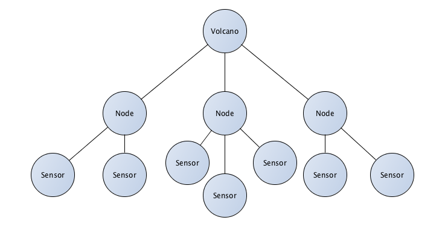

Predix Services
---------------

Predix Services are provided through a catalog or marketplace of microservices.
Each is focused on solving a specific problem well.  In the case of our Volcano
App, each solves a problem around persistence.

Additionally the Predix Python SDK (PredixPy_) helps work with these services by
providing client libraries.

.. _PredixPy: https://github.com/PredixDev/predixpy.git

User Account and Authentication (UAA)
.....................................

The `User Account and Authentication Service (UAA)`_ is an OAuth2
implementation that is part of the Cloud Foundry architecture.  It provides
centralized identity management and a secure login interface.

The Volcano application does not have user authentication concerns, but for
provisioning other microservices Predix typically uses client credentials from
UAA to monitor access.

The Volcano App needed:

- an admin account for maintaining UAA itself
- a client account with client_id and secret for our application to use that is
  granted permission to access **Predix Asset** and **Predix Time Series**

.. _`User Account and Authentication Service (UAA)`: https://www.predix.io/services/service.html?id=1172

Predix Asset
............

The `Predix Asset`_ service provides a graph database, query engine, and
document store for representing the industrial "things" that can be managed.
It has some integration opportunities with other services so often is the
foundation of many Predix Industrial IoT solutions.

.. _`Predix Asset`: https://www.predix.io/services/service.html?id=1171

The Volcano App needed:

- a persistence solution for the volcano sensor network
    - that can store the relationship between nodes
    - that can be traversed quickly for slicing relationships
    - that can be extended as new attributes are added
    - that has a unique URI to represent individual assets

The relationship between volcano, nodes, and sensors is represented in the
following graphic:

Predix Asset has behavior similar to a NoSQL document store solution.  Each
asset can be stored with a JSON body that contains extra attributes.  This data
can then be queried so that relationships of manufacturer, precision, unit
measures, etc. can be inspected when identifying assets.

The Predix Python SDK provides an ORM like solution of representing Asset
Collections so that one can create Domain Objects natively in Python and
persist the data to the Predix Asset service.

There are many other features of Predix Asset that were not needed for the
Volcano App but are common in industrial use cases:

- built-in audit history for device failures
- connectors with Predix Asset and Predix Time Series
- scripting engine for domain-specific business logic

View the `Predix Asset Documentation`_ for much more information about these
other features.

A few implementation notes:

- The *setup/ingest_data.py* script demonstrates populating the Predix Asset service
- The Predix Asset service lets you determine your own URI scheme to represent assets
  and asset relationships and is a required argument.  There is a max depth to
  these URIs is two levels.  A nested resource relationship is not recommended
  (ie. /volcano/:id/node/:id )

.. _`Predix Asset Documentation`: https://docs.predix.io/en-US/content/service/data_management/asset/

Predix Time Series
..................

The `Predix Time Series`_ service provides a persistent store for a sequence of
data collected at set time intervals over a continuous period of time.  This is
a frequent use case in Industrial IoT applications that are collecting samples
of data from a sensor over time.

.. _`Predix Time Series`: https://www.predix.io/services/service.html?id=1177

The Volcano App needed:

- a persistence solution for the data collected from sensors
    - that can be queried over time
    - that can scale for data analytics runtime computations
    - that can be queried for basic visualizations and filters
    - that can be traced back to the asset the data was collected from
    - that can store Quality of Service details for when sensor data being
      collected could be unreliable

There are features of Predix Time Series that were not needed for the Volcano
App but are common in industrial use cases:

- millisecond data point precision common in control systems

View the `Predix Time Series Documentation`_ for much more information about
these other features.

.. _`Predix Time Series Documentation`: https://docs.predix.io/en-US/content/service/data_management/time_series/

A few implementation notes:

- The *setup/ingest_data.py* script demonstrates populating the Time Series
  instance from a CSV file which is provided as an alternative data source
- The attributes was primarily used to identify the volcano / sensors for quick
  filtering
- The tags are representative of the type of data being collected -- so
  temperature data shares a common tag TPA and is the basis of doing queries
- The timestamp will always have millisecond precision in UTC even if rounded
  to the nearest second

