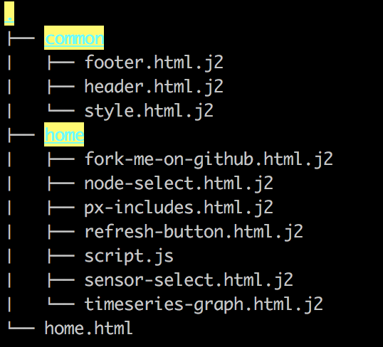

Predix UI
---------

The User Interface for the Predix Volcano App should be very straightforward
to demonstrate how to build more complex dashboards.

The requirements were:

- allow selection of a volcano node
- allow selection of one or more sensors to display
- plot data points on a visualization over time

Client
......

The primary visual **Predix UI** components are called out in this screenshot:

.. image:: images/volcanoapp-components.png

You can find each of these components with source code and live configurable
demos on the `Predix UI`_ design system website.

.. _`Predix UI`: https://www.predix-ui.com

- **px-spinner** lets user know data is being loaded ( `source`__ ) ( `demo`__ )

.. __: https://github.com/PredixDev/px-spinner
.. __: https://www.predix-ui.com/#/components/px-spinner/

- **px-dropdown** lets user select from pre-defined values ( `source`__ ) ( `demo`__ )

.. __: https://github.com/PredixDev/px-dropdown
.. __: https://www.predix-ui.com/#/components/px-dropdown/

- **px-vis-timeseries** lets user see data points plotted in a graph and zoom-in / inspect individual points ( `source`__ ) ( `demo`__ )

.. __: https://github.com/PredixDev/px-vis-timeseries
.. __: https://www.predix-ui.com/#/components/px-vis-timeseries/

These components are based on the `Polymer` JavaScript library.  In order to
use these web components you need to use `Bower` to package the HTML and CSS
dependencies.

.. _Polymer: https://www.polymer-project.org/
.. _Bower: https://bower.io/

In addition to the Predix UI Web Components the look and feel of the
application uses `Sass`_ to make CSS management more easy to manage.  The
JavaScript task runner `Gulp`_ is used to take care of building the CSS and
potentially any other web application work such as minimizing JavaScript, etc.
In order to use Gulp the `NPM`_ Node Package Manager is required to pull
JavaScript dependencies.

.. _Sass: http://sass-lang.com/
.. _Gulp: https://gulpjs.com/
.. _npm: https://www.npmjs.com/

Finally, for some basic JavaScript operations `jQuery`_ helps with basic
selectors and cross-browser compatibility.

.. _jQuery: https://jquery.com/

Server
......

Since Python is a great language for data science applications the back-end of
the Volcano App was also built using Python and the popular `Flask`_ framework
and templates rendered with `Jinja`_.

.. _Flask: http://flask.pocoo.org/
.. _Jinja: http://jinja.pocoo.org/

Here is the organization of the templates that correspond with the final
rendered user interface.

